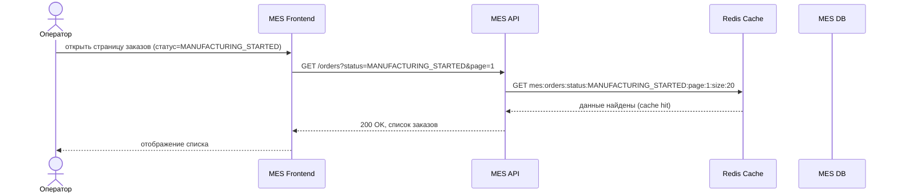
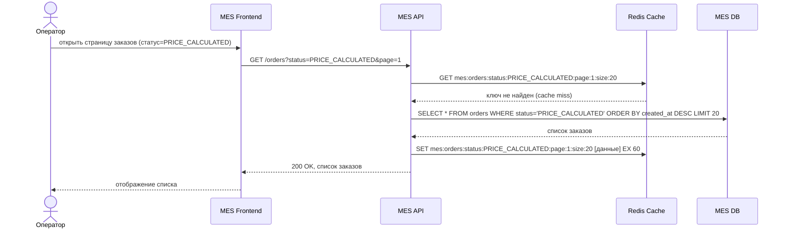
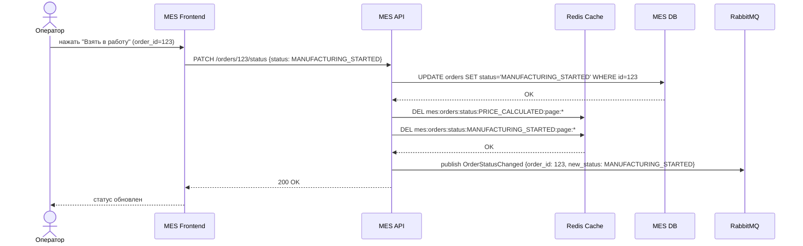

# Архитектурное решение по кешированию

## Контекст

Система Александрит состоит из трех приложений: онлайн-магазин (Vue + SpringBoot), CRM (Vue + SpringBoot) и MES (React + C#). Все три работают с PostgreSQL-базами данных. Между CRM и MES настроена асинхронная интеграция через Messages Queue (RabbitMQ). Каждый компонент развернут в единственном экземпляре на Yandex Cloud EC2. Нагрузка растет линейно: плюс 100 заказов в месяц.

---

## Мотивация

Операторы MES жалуются на медленную загрузку первой страницы - дашборда со списком заказов по статусам. Команда уже добавила фильтр по статусам и пагинацию, но скорость не улучшилась. Это говорит о том, что проблема не в объеме данных, передаваемых на клиент, а в стоимости самого запроса к базе данных.

Корень проблемы - паттерн использования данных. Несколько операторов одновременно смотрят на один и тот же список заказов (по статусу, отсортированный по дате). Каждое открытие страницы - это отдельный SELECT к MES DB, который при растущем числе заказов становится все тяжелее. При этом данные для всех операторов одинаковые.

Второй аспект - вознаграждение операторов зависит от того, кто первым возьмет заказ. Это создает высокочастотные обращения к странице в момент появления новых заказов, нагрузка пиковая, а не равномерная.

Без кеширования ситуация будет ухудшаться пропорционально росту числа заказов в таблице MES DB.

Что кешируем:

- список заказов по статусу с пагинацией (горячие данные, одинаковые для всех операторов)

Что не кешируем:

- расчет стоимости 3D-изделия (уникален для каждой модели, занимает 2-30 минут, кеш не имеет смысла)
- детальная страница конкретного заказа при редактировании (риск подачи устаревших данных)
- данные, специфичные для одного пользователя (история действий оператора и т.п.)

---

## Предлагаемое решение

### Тип кеширования

Применим серверное кеширование (server-side cache).

Клиентский кеш (HTTP Cache-Control, Service Worker) в данном случае не решает задачу. Данные обновляются действиями других пользователей. Если оператор А берет заказ, оператор Б должен увидеть изменение при следующем обращении, без перезагрузки страницы вручную. Клиентский кеш этого не обеспечит без дополнительного механизма инвалидации на клиенте, что усложняет решение без выигрыша.

Технология: Redis (in-memory key-value store).

### Паттерн кеширования

Используем Cache-Aside.

В чем логика:

1. MES API получает запрос на список заказов по статусу.
2. Проверяет наличие данных в Redis по ключу.
3. Если данные есть (cache hit), возвращает их без обращения к БД.
4. Если данных нет (cache miss), идет в MES DB, получает результат, записывает в Redis, возвращает клиенту.

Почему не write-through? Изменения статусов заказов приходят через RabbitMQ от CRM, а не прямую запись через MES API. Использование write-through предполагает, что все записи проходят через кеш-слой синхронно, а это условие здесь не выполнено.

Почему не refresh-ahead? Этот паттерн требует предсказания, какие данные будут запрошены следующими. При работе операторов с фильтром по любому из десяти статусов предсказать следующий запрос затруднительно. Реализация усложнится без существенного выигрыша.

### Структура ключей кеша

Формат ключа: `mes:orders:status:{STATUS}:page:{PAGE}:size:{SIZE}`

Примеры:

- `mes:orders:status:MANUFACTURING_STARTED:page:1:size:20`
- `mes:orders:status:PRICE_CALCULATED:page:1:size:20`

Такой формат позволяет точечно инвалидировать только тот статус, в котором произошло изменение, не трогая остальные ключи.

### Диаграмма последовательности

Сценарий 1. Чтение списка заказов, данные в кеше (cache hit):

Сценарий 2. Чтение списка заказов, данные отсутствуют в кеше (cache miss):

Сценарий 3. Оператор берет заказ в работу (изменение статуса + инвалидация кеша):

### Стратегия инвалидации кеша

| Стратегия          | Суть                                                                                                              | Подходит?                                                    |
| --------------------------- | --------------------------------------------------------------------------------------------------------------------- | -------------------------------------------------------------------- |
| Временная (TTL)    | Кеш сбрасывается автоматически через N секунд                                  | Частично, используется как страховка |
| По ключу (key-based) | При изменении данных явно удаляется соответствующий ключ из Redis | Да, это основная стратегия                    |
| Программная      | Произвольная логика сброса, определяемая приложением                   | Это частный случай key-based                         |

Выбор: инвалидация по ключу при изменении статуса заказа + TTL = 60 секунд как страховка.

Обоснование:

- Key-based инвалидация - основной механизм. Когда оператор меняет статус заказа через MES API, приложение сразу удаляет из Redis ключи, затрагивающие старый и новый статус. Операторы на других вкладках при следующем запросе получат актуальные данные.
- TTL = 60 секунд - страховка на случай нештатной ситуации. Если MES API упадет после записи в БД, но до инвалидации кеша, данные в Redis устареют максимум на 60 секунд, после чего сбросятся автоматически.
- Временная инвалидация без key-based не подходит как единственная стратегия. При активной работе операторов (они конкурируют за заказы) 60 секунд устаревших данных могут привести к двойному назначению.

---

## Сравнение решений

### Решение 1. Redis Cache-Aside (рекомендуемое)

Добавляется Redis-инстанс. MES API изменяется, добавляется проверка кеша перед обращением к БД и инвалидация при изменении статусов.

Плюсы:

- данные отдаются из памяти, задержка менее 1 мс против десятков мс из БД
- снижает нагрузку на MES DB в разы при высокочастотных обращениях операторов
- легко масштабируется (Redis Cluster при необходимости)

Минусы:

- добавляется новый инфраструктурный компонент
- нужна инвалидация кеша при изменении статусов, а это требует изменений в MES API
- при падении Redis нужен graceful degradation (fallback на прямой запрос в БД)

### Решение 2. Read Replica для MES DB

Добавляется реплика MES DB только для чтения. MES API отправляет SELECT-запросы на реплику.

Плюсы:

- минимальные изменения в коде приложения (только строка подключения для read-запросов)
- прозрачно для бизнес-логики
- PostgreSQL поддерживает streaming replication нативно

Минусы:

- репликация имеет задержку (лаг репликации), операторы могут видеть данные на несколько секунд позже реального состояния, при конкуренции за заказы это проблема
- снижает нагрузку на основной узел БД, но не уменьшает количество запросов к данным
- дороже по ресурсам, второй инстанс БД того же размера

|                                                 | Решение 1 (Redis)                           | Решение 2 (Read Replica)               |
| ----------------------------------------------- | -------------------------------------------------- | --------------------------------------------- |
| Скорость ответа                   | менее 1 мс (из памяти)              | 5-50 мс (из БД с диска)           |
| Актуальность данных           | управляется инвалидацией    | зависит от replication lag           |
| Стоимость изменений           | средняя (Redis + изменения в API) | низкая (только конфиг БД) |
| Нагрузка на основную БД     | снижается существенно          | снижается умеренно           |
| Риск при пиковой нагрузке | низкий                                       | умеренный                            |

Заключение: Redis Cache-Aside предпочтительнее для данного кейса. Проблема операторов не в нагрузке на основной узел БД, а в том, что каждый запрос к списку заказов физически читает таблицу. Redis убирает эти запросы из БД полностью для горячих данных. Read Replica перенесла бы запросы на другой узел, но не сократила бы их количество. Для сценария с конкурирующими операторами нужна управляемая актуальность данных, а не минимизация лага репликации.

---

## Изменения в архитектуре

К существующей C4-диаграмме добавляется один новый компонент:

- Redis Cache - Container, технология: Redis. Кеш списков заказов по статусам для MES API. Хранит сериализованные результаты пагинированных запросов.

Новые связи:

- MES API -> Redis Cache: чтение/запись кешированных списков заказов
- MES API -> Redis Cache: инвалидация ключей при изменении статуса заказа

---

## Оценка эффекта

До кеширования при 10 операторах, открывающих страницу каждые 30 секунд, MES DB получает примерно 20 запросов в минуту к таблице заказов. При росте таблицы до 10 000+ строк каждый такой запрос занимает сотни миллисекунд даже с индексами.

После кеширования при TTL 60 секунд и типичном паттерне (операторы смотрят 2-3 статуса) Redis будет обслуживать более 95% запросов без обращения к БД. Нагрузка на MES DB от операторского дашборда фактически пропадает.
